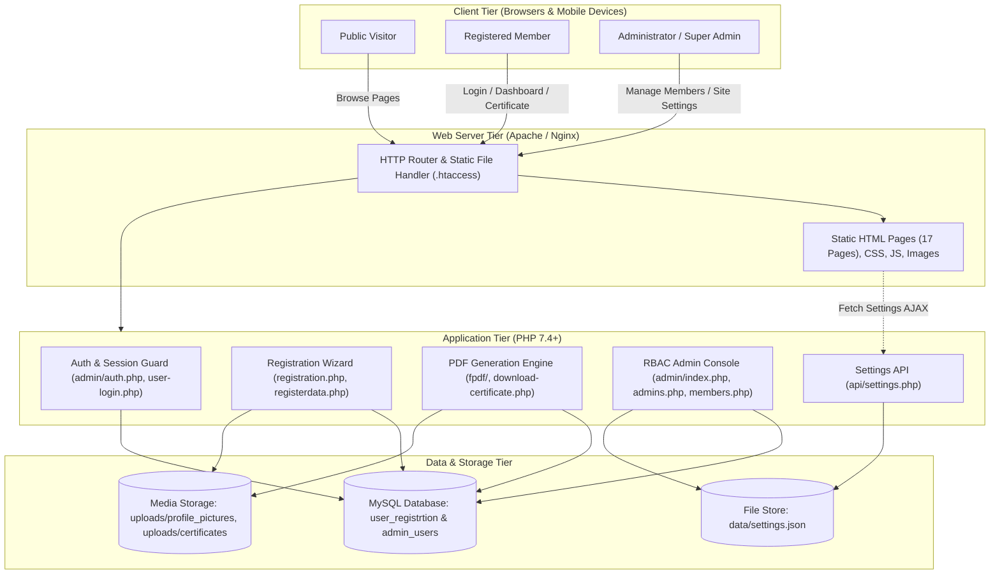
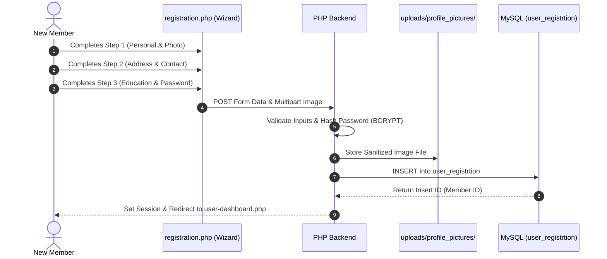
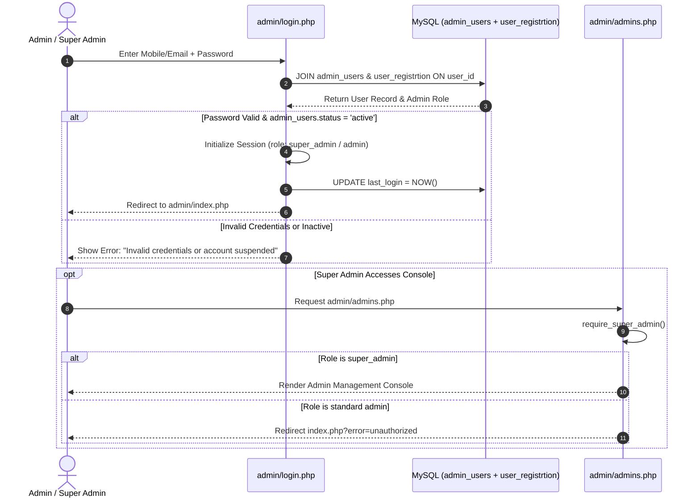
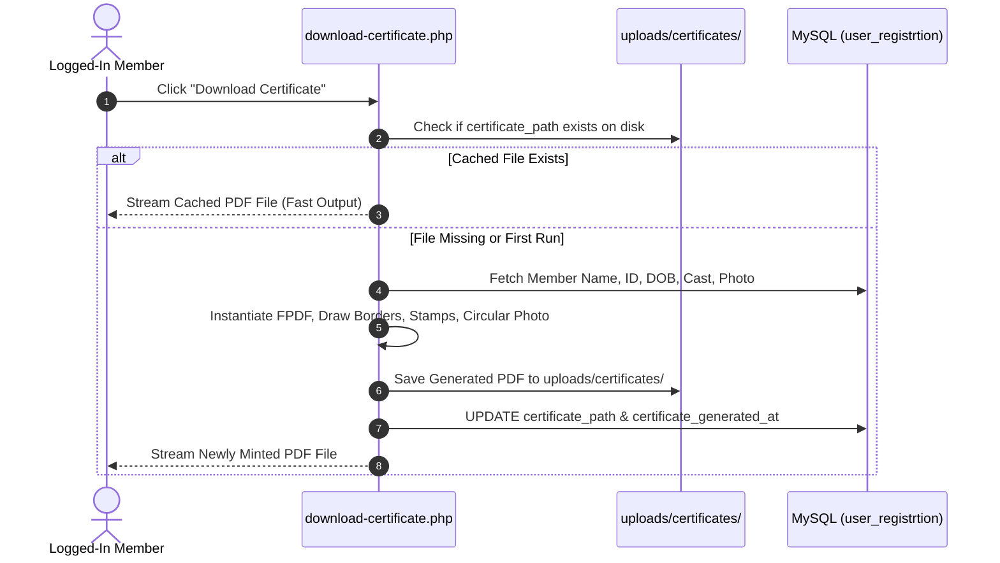

# System Architecture Document

## Anjuman Eraquee INDIA — Engineering Architecture & System Design

| Metadata | Details |
| :--- | :--- |
| **Document Version** | 1.0.0 |
| **Date** | September 20, 2026 |
| **Status** | Active / Production Blueprint |
| **Project Repository** | `nadim144/anjuman_eraquee` |
| **Runtime Environment** | Apache / PHP 7.4+ / MySQL 5.7+ / MariaDB |

---

## 1. High-Level Architecture

The platform follows a **Modular Layered Architecture** combining a responsive presentation layer, a decoupled JSON-driven configuration store, a procedural service backend, and an ACID-compliant relational MySQL database.



---

## 2. Technology Stack

| Layer | Technology | Version | Purpose |
| :--- | :--- | :--- | :--- |
| **Frontend UI** | HTML5 / CSS3 / SCSS | Latest standards | Semantic markup and custom modern styles |
| **CSS Framework** | Bootstrap (Mosque Theme) | 3.3.7 / 4.x compatible | Responsive 12-column grid and mobile UI |
| **Client Scripting** | JavaScript (Vanilla) + jQuery | ES6+ / jQuery 3.x | DOM manipulation, multi-step validation, live preview |
| **Iconography** | FontAwesome | 4.7.0 / 5.x | High-contrast visual icons across UI |
| **Backend Engine** | PHP | 7.4 - 8.2 | Application routing, sessions, data processing |
| **Database Engine** | MySQL / MariaDB | 5.7+ / 10.3+ | Persistent relational storage for members & admins |
| **PDF Generation** | FPDF | 1.8.x | Dynamic vector PDF rendering for membership certificates |
| **Configuration** | JSON | RFC 8259 | File-based fast configuration (`data/settings.json`) |
| **Development Web Server** | Apache via XAMPP | 2.4.x | Local development environment on port `8080` |
| **Production Hosting** | Apache Shared Host | Linux / cPanel | Remote production hosting (InfinityFree / Live Host) |

---

## 3. Directory & Folder Structure

```
c:\xampp\htdocs\anjuman_eraquee/
├── Architecture/                   # Architectural & Engineering Documentation Suite
│   ├── PRD.md                      # Product Requirements Document
│   ├── ARCHITECTURE.md             # System Architecture & Tech Specs (This Document)
│   ├── DESIGN.md                   # UI/UX Design System & Theme Specs
│   ├── RULES.md                    # Engineering Rules & Coding Standards
│   ├── TASKS.md                    # Project Tasks Breakdown & Development Roadmap
│   ├── TEST_PLAN.md                # Quality Assurance & Testing Plan
│   ├── SECURITY.md                 # Security Architecture & Hardening Guide
│   ├── DECISIONS.md                # Architecture Decision Records (ADRs)
│   └── MEMORY.md                   # Project Context & AI Agent Reference
├── admin/                          # Administrative Portal (RBAC Protected)
│   ├── admins.php                  # Super Admin Exclusive Management Console
│   ├── auth.php                    # Admin Authentication & RBAC Guard
│   ├── index.php                   # Administrative Dashboard & Overview Stats
│   ├── login.php                   # Dynamic Member-Credential Admin Login
│   ├── logout.php                  # Admin Session Termination
│   ├── members.php                 # Registered Member Directory, CRUD, CSV Export
│   ├── settings.php                # Site Content & Contact Phone Editor
│   └── css/                        # Dedicated Admin Panel Stylesheet
│       └── admin.css
├── api/                            # Internal REST Endpoints
│   └── settings.php                # Serves data/settings.json as JSON to Frontend
├── css/                            # Public Site Stylesheets
├── data/                           # Data Store (JSON Configuration)
│   └── settings.json               # Dynamic Phone Numbers, Emails, Video URLs
├── fpdf/                           # FPDF PDF Generation Engine
│   └── fpdf.php
├── images/                         # Static Assets, Logos, and Dummy Avatars
│   ├── dummy-avatar.svg            # Fallback Vector Profile Silhouette
│   └── icon/tabicon.jpeg           # Favicon Icon
├── js/                             # Frontend JavaScript
│   ├── custom.js                   # Navigation, Hamburger, Slider Controls
│   └── site-settings.js            # Dynamic Topbar/Footer Phone Number Injector
├── uploads/                        # Dynamic User Media & Artifact Storage
│   ├── certificates/               # Cached Persistent PDF Membership Certificates
│   └── profile_pictures/           # Member Profile Photos
├── db.php                          # Central DB Connection & Non-Destructive Auto-Migrator
├── db_config.php                   # Optional Local/Remote DB Overrides (Not Committed)
├── download-certificate.php        # Dynamic PDF Certificate Generator Controller
├── index.html                      # Homepage (17 Total HTML Marketing Pages)
├── registration.php                # Multi-Step Member Registration Wizard
├── registerdata.php                # Legacy/Direct Member Registration Processor
├── user-dashboard.php              # Member Self-Service Dashboard & Profile Editor
├── user-login.php                  # Member Authentication (Mobile/Email + Password)
├── user-logout.php                 # Member Session Termination
├── user-reset-password.php         # Password Reset & Update Processor
├── user-verify-otp.php             # OTP / Verification Flow
├── work.md                         # Historical Development Work Log
└── style.css                       # Primary Application Master Stylesheet
```

---

## 4. Key Data Flows

### A. Member Registration & Profile Activation Flow


### B. Dynamic Member-Credential Admin Login & RBAC Flow


### C. Membership Certificate Generation & Caching Flow


---

## 5. Database Architecture & Schema

The database consists of two core tables designed with relational integrity:

### 1. Table: `user_registrtion` (Member Records)
| Column | Type | Nullable | Default | Description |
| :--- | :--- | :---: | :---: | :--- |
| `id` | `INT(11)` | NO | `AUTO_INCREMENT` | Primary Key, unique Member Registration Number |
| `username` | `VARCHAR(255)` | YES | `NULL` | Member's Full Name |
| `fathername` | `VARCHAR(255)` | YES | `NULL` | Father's Full Name |
| `mothername` | `VARCHAR(255)` | YES | `NULL` | Mother's Full Name |
| `grandfathername` | `VARCHAR(255)` | YES | `NULL` | Grandfather's Full Name |
| `nativeplace` | `VARCHAR(255)` | YES | `NULL` | Ancestral village / Native town |
| `age` | `VARCHAR(50)` | YES | `NULL` | Computed Age in years |
| `dob` | `DATE` | YES | `NULL` | Date of Birth |
| `gender` | `VARCHAR(50)` | YES | `NULL` | Gender (`Male`, `Female`, `Other`) |
| `maritalstatus` | `VARCHAR(50)` | YES | `NULL` | Marital Status (`Single`, `Married`, etc.) |
| `cast` | `VARCHAR(100)` | YES | `NULL` | Community Sub-caste / Category |
| `aadhaar_number`| `VARCHAR(20)` | YES | `NULL` | 12-digit Indian Aadhaar Card Number |
| `profile_picture`| `VARCHAR(255)`| YES | `NULL` | Relative path to profile photograph |
| `phonenumber` | `VARCHAR(100)` | YES | `NULL` | Primary 10-digit mobile number |
| `additional_mobile`| `VARCHAR(20)`| YES | `NULL` | Alternate / Secondary mobile number |
| `whatsappnumber` | `VARCHAR(100)`| YES | `NULL` | WhatsApp contact number |
| `email` | `VARCHAR(255)` | YES | `NULL` | Email address (Unique contact identifier) |
| `presentaddress` | `TEXT` | YES | `NULL` | Present residential address |
| `presentdistrict`| `VARCHAR(255)`| YES | `NULL` | Current District |
| `presentstate` | `VARCHAR(255)` | YES | `NULL` | Current State |
| `presentpincode` | `VARCHAR(50)` | YES | `NULL` | PIN Code |
| `permanentaddress`| `TEXT` | YES | `NULL` | Permanent address |
| `qulification` | `VARCHAR(255)` | YES | `NULL` | Educational Qualification |
| `occupation` | `VARCHAR(255)` | YES | `NULL` | Profession / Employment |
| `password` | `VARCHAR(255)` | YES | `NULL` | Bcrypt-hashed password |
| `is_temp_password`| `TINYINT(1)` | YES | `0` | Flag: 1 if user must reset password on login |
| `reset_requested`| `TINYINT(1)` | YES | `0` | Flag: 1 if user requested admin password assistance |
| `certificate_path`| `VARCHAR(255)`| YES | `NULL` | Cached path to generated PDF certificate |
| `certificate_generated_at`| `DATETIME`| YES | `NULL` | Timestamp of certificate generation |
| `created_at` | `TIMESTAMP` | NO | `CURRENT_TIMESTAMP` | Member registration date |

---

### 2. Table: `admin_users` (Role-Based Access Control)
| Column | Type | Nullable | Default | Description |
| :--- | :--- | :---: | :---: | :--- |
| `id` | `INT(11)` | NO | `AUTO_INCREMENT` | Primary Key, Admin record ID |
| `user_id` | `INT(11)` | NO | `None` | **UNIQUE** Foreign Key linking to `user_registrtion(id)` |
| `role` | `ENUM('super_admin','admin')` | NO | `'admin'` | RBAC Role designation |
| `status` | `ENUM('active','inactive')` | NO | `'active'` | Account status (Active or Suspended) |
| `created_by` | `INT(11)` | YES | `NULL` | Admin ID of the promoter who granted admin rights |
| `created_at` | `TIMESTAMP` | NO | `CURRENT_TIMESTAMP` | Timestamp when promoted to admin |
| `last_login` | `DATETIME` | YES | `NULL` | Timestamp of last successful administrative login |

---

## 6. Infrastructure & Deployment Setup

### Local Development Environment
- **Web Server**: Apache running via XAMPP on Windows.
- **Port**: `8080` (configured to prevent standard port 80 conflicts with Windows IIS / World Wide Web Publishing Service).
- **MySQL Ports**: Auto-detects port `3307` or `3306` via connection cascade in `db.php`.

### Production Environment (Shared Host / InfinityFree)
- **Web Server**: Apache Linux with `.htaccess` support.
- **Auto-Migration**: Self-healing `db.php` checks for missing columns and tables on runtime, ensuring zero manual CLI commands are required on shared hosts without SSH.
- **File Upload Perms**: `uploads/` directory with `0755` permissions for secure asset writes.

